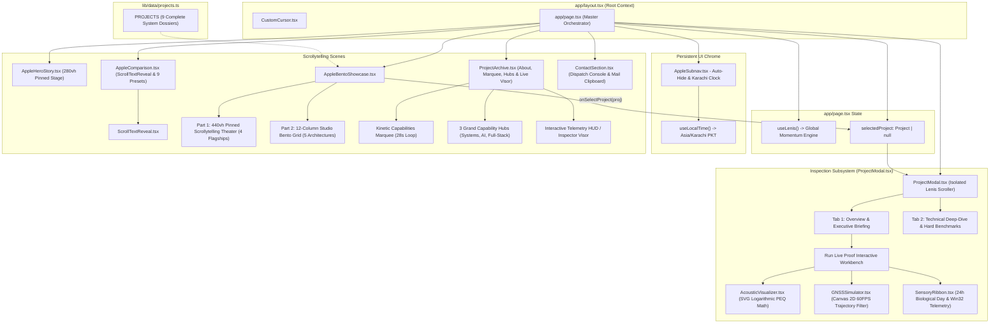

# Comprehensive UI & Frontend System Architecture
## Khuzaima Ahmed — Systems & AI Engineering Portfolio Omniverse

---

## 1. Executive Summary & Architectural Philosophy

The **Khuzaima Ahmed Portfolio Omniverse** is an editorial, Apple Pro-inspired cinematic scrollytelling engineering platform. Rather than functioning as a standard static portfolio, the application is engineered as a **deterministic, hardware-accelerated showroom** designed to convey low-level systems engineering, sensor fusion, real-time digital signal processing (DSP), and zero-overhead local-first AI architectures.

```
+--------------------------------------------------------------------------------------------------+
|                                    VISUAL & ENGINEERING PILLARS                                  |
+------------------------------------+------------------------------------+------------------------+
| 1. Apple Pro Scrollytelling        | 2. Dual-Layer 120 FPS Momentum     | 3. In-Browser Proof    |
| - Pure #000000 carbon canvas       | - Decoupled Viewport Lenis Engine  | - Real-time biquad DSP |
| - Frosted glassmorphism (24px blur)| - Scoped Modal Momentum Scroller   | - 60 FPS Kalman Canvas |
| - -0.05em tight letter tracking    | - Hardware compositing layers      | - 24-hr sensory ribbon |
+------------------------------------+------------------------------------+------------------------+
```

### Core Design Values
- **Deterministic Aesthetics**: Minimalist dark UI palette adhering strictly to Apple's design language (`#000000` pitch black, `#161617` elevated surfaces, `#1D1D1F` card bodies, and `#2997FF` electric blue accents).
- **Show, Don't Tell**: Replacing buzzwords with interactive mathematical models executed live on client silicon (logarithmic SVG PEQ frequency response calculator, HTML5 Canvas 2D GNSS Rauch-Tung-Striebel trajectory smoother, and Win32 ctypes sensory timeline simulation).
- **Dual-Layer Momentum Scroll Physics**: Global viewport momentum scrolling combined with non-blocking, isolated modal drawer scrolling, eliminating standard browser scrollbar friction.

---

## 2. Complete Component Hierarchy & Data Flow



---

## 3. Technology Stack & Runtime Dependencies

The project is built on a clean, modern React 19 / Next.js 14 stack:

| Technology | Version | Purpose in Architecture |
|---|---|---|
| **Next.js** | `14.2.24` | React Server Components & App Router orchestration |
| **React & React-DOM** | `^18.3.1 / 19.x` | Client-side reactive component tree |
| **TypeScript** | `^5.6.3` | Strict type validation and domain interfaces (`Project`, `EQBand`, `TechDetail`, etc.) |
| **Tailwind CSS** | `^3.4.14` | High-performance utility CSS with custom Apple design tokens |
| **Framer Motion** | `^11.11.17` | Hardware-accelerated transitions, `useScroll`, `useTransform`, spring physics |
| **Lenis** | `^1.1.18` | Decoupled smooth momentum physics for root viewport and deep-dive drawer |
| **Lucide React** | `^0.454.0` | Minimalist aerospace/hardware iconography |
| **Three.js** | `^0.169.0` | 3D mathematical primitives and geospatial coordinate calculations |
| **Google Fonts** | Inter, JetBrains Mono, Space Grotesk | Dual typography: Technical telemetry monospace + clean Apple sans-serif |

---

## 4. Application Bootstrapping & Global Styling

### `app/layout.tsx`
- Sets the HTML document class to `dark` with a pure black background (`bg-black`) and Apple standard foreground typography (`text-apple-text`).
- Enforces anti-aliasing: `-webkit-font-smoothing: antialiased` and `-moz-osx-font-smoothing: grayscale`.
- Mounts the global `<CustomCursor />` component at root level to ensure smooth pointer tracking across the viewport.
- Configures comprehensive metadata for search engines and OpenGraph previews.

### `app/globals.css`
Defines CSS custom properties and acceleration rules:
```css
:root {
  --apple-black: #000000;
  --apple-space: #0A0A0C;
  --apple-surface: #161617;
  --apple-card: #1D1D1F;
  --apple-text: #F5F5F7;
  --apple-subtle: #86868B;
  --apple-blue: #2997FF;
}
```

Key Utility Classes:
- `.apple-card`: Provides `#161617` surface background, 1px `rgba(255, 255, 255, 0.08)` border, deep elevation shadow, and GPU composition layer via `transform: translateZ(0)` and `will-change: transform`.
- `.apple-subnav`: Applies `rgba(22, 22, 23, 0.82)` with 24px backdrop blur (`backdrop-filter: blur(24px)`).
- Ambient Specular Glows: `.specular-glow`, `.blue-glow`, and `.amber-glow` for cinematic background lighting effects.
- `.animate-marquee`: Hardware-accelerated infinite horizontal loop for capabilities marquee (28s duration, pauses on `:hover`).
- Lenis Momentum Classes: Standardizes overscroll behavior with `[data-lenis-prevent]` support.

### `tailwind.config.ts`
Extends Tailwind with custom tokens:
- **Colors**: `apple-black`, `apple-gray` (`#161617`), `apple-card` (`#1d1d1f`), `apple-subtle` (`#86868b`), `apple-blue` (`#2997ff`), `apple-text` (`#f5f5f7`).
- **Letter Spacing**: `apple-tight` (`-0.02em`), `apple-tighter` (`-0.03em`), and signature `apple-tightest` (`-0.05em`).
- **Border Radii**: `apple-sm` (12px), `apple-md` (18px), `apple-lg` (28px), `apple-xl` (40px).

---

## 5. Dual-Layer Momentum Physics: The Lenis Architecture

One of the most complex UI challenges in scrollytelling web apps is momentum scroll conflict when displaying deep-dive modal drawers over long pinned pages. The repository implements an isolated, two-tier scroll arbitration pattern:

```
+------------------------------------------------------------------------------------+
|                                 ROOT VIEWPORT                                      |
|  useLenis() -> Window Scroll Engine (duration: 0.85s, exponential easing)          |
|  Controlled via global (window as any).__lenis                                     |
+------------------------------------------------------------------------------------+
                                      |
                           [Project Click Trigger]
                                      |
                                      v
+------------------------------------------------------------------------------------+
|                         PROJECT DEEP-DIVE MODAL DRAWER                             |
|  1. document.body.style.overflow = "hidden"                                        |
|  2. (window).__lenis.stop()                                                        |
|  3. Instantiate Local Scoped Lenis(wrapper: scrollWrapperRef, duration: 0.80s)     |
|  4. Attribute: data-lenis-prevent="true" prevents event bubbling                   |
|  5. On Close: modalLenis.destroy() -> (window).__lenis.start()                      |
+------------------------------------------------------------------------------------+
```

### Global Lenis Implementation (`lib/hooks/useLenis.ts`)
```typescript
const lenis = new Lenis({
  duration: 0.85,
  easing: (t) => Math.min(1, 1.001 - Math.pow(2, -10 * t)),
  orientation: "vertical",
  gestureOrientation: "vertical",
  smoothWheel: true,
  wheelMultiplier: 1.0,
  touchMultiplier: 1.5,
});
```
The custom easing formula `Math.min(1, 1.001 - Math.pow(2, -10 * t))` emulates Apple iOS momentum deceleration.

---

## 6. Chrome & Telemetry Subsystems

### Custom Cursor (`components/chrome/CustomCursor.tsx`)
- **Hardware Mouse Tracking**: Driven by Framer Motion `useMotionValue` and `useSpring` with physics parameters:
  - `damping: 25`, `stiffness: 350`, `mass: 0.5`.
- **Target Detection**: On every `mousemove`, inspects the event target:
  ```typescript
  const interactiveEl = target?.closest("button, a, [data-cursor-label], [data-cursor-interactive]");
  ```
- **Dynamic States**:
  1. *Default State*: 6px electric blue center dot + 24px subtle ring (`rgba(255, 255, 255, 0.2)`).
  2. *Interactive Hover*: Ring expands to 44px (or 64px if a label is present), borders shift to `rgba(41, 151, 255, 0.7)`, and background fills with subtle blue tint (`rgba(41, 151, 255, 0.08)`).
  3. *Label Display*: If the hovered element defines `data-cursor-label="INSPECT"`, the ring renders monospace uppercase text inside the follower.
- **Touch Screen Guard**: Disables automatically if `window.matchMedia("(pointer: coarse)").matches` evaluates to `true`.

### Floating Master Navigation (`components/chrome/AppleSubnav.tsx`)
- **Direction-Aware Auto-Hide**:
  - Scrolling down ($> 10\text{px}$) smoothly glides the subnav up $-80\text{px}$ (`opacity: 0`, `scale: 0.96`).
  - Scrolling back up ($< -10\text{px}$) or staying near top ($\le 80\text{px}$) smoothly returns it into view (`y: 0`, `opacity: 1`, `scale: 1`).
- Positioned as `sticky top-4 z-50` with high-elevation drop shadow and frosted glass backdrop (`bg-[#161617]/85 backdrop-blur-2xl border-white/10 rounded-full`).
- **Telemetry Clock**: Consumes the `useLocalTime` hook (`lib/hooks/useLocalTime.ts`), querying `Intl.DateTimeFormat` with `timeZone: "Asia/Karachi"` to render live Pakistan Standard Time (PKT) in a tabular monospace badge.
- **Availability Beacon**: Green pulsing status indicator (`bg-emerald-400 animate-pulse`) signaling role availability.
- **Smooth Anchor Links**: Quick jumps to `#storyboard`, `#bento`, `#compare`, `#archive`, and `#contact`.
- **Action CTA**: Direct `"Dispatch ↗"` button jumping to the footer dispatch terminal.

---

## 7. Cinematic Scrollytelling Storyboard (`AppleHeroStory.tsx`)

The hero section uses a **280vh pinned viewport canvas** (`h-[280vh]`) orchestrated through Framer Motion's `useScroll`:

```typescript
const { scrollYProgress } = useScroll({
  target: containerRef,
  offset: ["start start", "end end"],
});
```

### 3-Stage Scroll Timeline Progression

```
Scroll Progress: 0.00 ---------- 0.38 ---------- 0.78 ---------- 1.00
               |     Stage 1     |     Stage 2     |   Stage 3   |
               | Massive Pitch   | 3 Stat Callouts | CTA Portal  |
```

1. **Stage 1 (`0.00` to `0.38`)**:
   - `stage1Opacity`: Linear fade from `1` down to `0` between 0.25 and 0.38.
   - `stage1Y`: Translates from `0` to `-40px`.
   - `imageScale`: Telemetry graphic scales from `1.2` to `1.0` (hardware parallax depth).
   - Headline: *"Most wanted. Deterministic."* with sub-headline explaining zero-overhead daemons, GNSS fusion, and Web Audio DSP.
2. **Stage 2 (`0.38` to `0.78`)**:
   - `stage2Opacity`: Cross-fades in from `0` at 0.38 to `1` at 0.48, holds until 0.72, and fades out by 0.82.
   - Comparative Metrics Cards:
     - `88.4%`: Lower horizontal error (1.235m RTS smoothed RMS).
     - `0.0%`: CPU sensory overhead (Win32 foreground ctypes).
     - `≤ 0.5 dB`: Automated PEQ residual error (Harman 301-pt curve match).
3. **Stage 3 (`0.80` to `1.00`)**:
   - Fades in the transition prompt (*"Explore the engineering"*) with a button linking directly to the `#bento` showcase.
4. **Dynamic Specular Lighting**:
   - Two ambient background gradient orbs (`blue-glow` and `amber-glow`) dynamically crossfade their opacity and position based on scroll progress.

---

## 8. Apple Comparison Matrix & Kinetic Typography (`AppleComparison.tsx`)

Inspired by Apple's product comparison matrices, this section provides quantitative benchmarks contrasting Khuzaima's architectures against industry-standard implementations.

### Word-by-Word Scroll Reveal (`ScrollTextReveal.tsx`)
- Splits narrative sentences into individual words.
- Maps each word's progress range to container scroll progress:
  ```typescript
  const start = i / words.length;
  const end = start + 1 / words.length;
  const opacity = useTransform(progress, [start, end], [0.22, 1]);
  ```
- Words matching `highlightWords` (e.g., *purpose-built*, *deterministic*, *Win32*, *GNSS*, *biquad*) receive bold white weight (`text-white font-semibold`), while standard words illuminate from subdued gray (`0.22` opacity) to readable silver (`1.0` opacity).

### Preset Switcher System
Users can expand the comparison matrix and switch between 9 comparison presets via an Apple-style dropdown:

| Preset ID | Industry Baseline Compared Against | Khuzaima's Engine | Primary Metrics Demonstrated |
|---|---|---|---|
| `gnss` | Raw Consumer GPS L1 (Standard) | GNSS Multi-Stream Fusion & RTS | **88.4% error drop**, 2,493 epochs, 0.062 m/s tunnel drift |
| `auditor` | Screen-Recording Daemons | The Silent AI Daily Auditor | **0.0% CPU drag**, 0 hrs ghost work, 30 min meeting AFK |
| `peq` | Manual Trial-and-Error PEQ | AudioSage Auto-PEQ Synthesizer | **≤ 0.5 dB RMS residue**, 23 ms capture, 48 steps/dec |
| `tokens` | Verbose JSON LLM Pipelines | CinemaVault CSV Pipe Encoding | **~60% token cut**, 0.0% hallucination, 3-tier failover |
| `learning` | Brute-Force Database Scraping | AI Learning Companion 2.0 | **80% query reduction**, 0 ms perceived load, SM-2 SRS |
| `yt` | Cloud-Heavy Analytics Tools | YT Tracker Growth Studio | **<15 ms in-browser NLP**, >60% topic moats, 0 quota waste |
| `mobile` | Sluggish Mobile Audio Recorders | Mobile Voice Notes Studio | **60 FPS visualizer**, <1 ms SQLite FTS5 search, exact OS alarms |
| `location` | Battery-Draining Geotrackers | My Location Diary | **Sub-10m Haversine**, 1-click email loop, 100% auto chronicle |
| `calorie` | Cloud-Locked Nutrition Apps | Smart Calorie Tracker Desktop | **0 ms local write**, 100% offline privacy, real-time macros |

---

## 9. Flagship Bento Showcase & Extended Suite (`AppleBentoShowcase.tsx`)

The showcase is divided into two distinct architectural tiers:

### Part 1: The Pinned Scrollytelling Theater (440vh Container)
- A **440vh pinned container** (`h-[440vh]`) locks the viewport while the user scrolls through the **4 Core Flagships**:
  - Chapter 01: `GNSS Multi-Stream Precision Positioning Engine`
  - Chapter 02: `AudioSage: Audiophile Research Assistant & Acoustic Suite`
  - Chapter 03: `The Silent AI Daily Auditor & Life Chronicle`
  - Chapter 04: `CinemaVault: Taste-Profiling Recommendation Engine`
- **Interactive Chapter Pill Switcher**: Clicking any chapter button (`01 GNSS`, `02 AudioSage`, etc.) calculates target scroll offset and triggers a smooth programmatic scroll:
  ```typescript
  const targetY = containerTop + (index / 4) * (containerHeight - window.innerHeight) + 50;
  window.scrollTo({ top: targetY, behavior: "smooth" });
  ```
- **Dynamic Specular Ambiance**: The glow behind the theater transitions colors dynamically based on the active flagship (Electric Blue for GNSS, Indigo for AudioSage, Emerald for Auditor, Amber for CinemaVault).
- **Independent Chapter Transitions**: Each chapter card has dedicated `opacity`, `translateY`, and `scale` interpolation curves mapped to its 25% slice of the scroll budget.

### Part 2: The Extended Pro Suite (12-Column Balanced Grid)
Below the pinned theater, a mathematically balanced **12-column grid** displays the remaining 5 specialized architectures:
- **Row 1 (`6 + 6 = 12`)**:
  - `AI Learning Companion 2.0` (`lg:col-span-6`): SM-2 Spaced Repetition // 80% SQL Query Cut.
  - `YT Tracker Growth Studio` (`lg:col-span-6`): <15ms Client-Side NLP // Competitor Topic Moats.
- **Row 2 (`4 + 4 + 4 = 12`)**:
  - `Mobile Voice Recorder & Notes Studio` (`lg:col-span-4`): 28-Bar 60 FPS Visualizer // SQLite FTS5.
  - `My Location Diary` (`lg:col-span-4`): Sub-10m Haversine Geofencing // 1-Click Verification Loop.
  - `Smart Calorie Tracker App` (`lg:col-span-4`): 0ms Desktop Latency // Local Macro Calculation Engine.

---

## 10. About, Capabilities Marquee & Live Telemetry Visor (`ProjectArchive.tsx`)

Section `#archive` functions as an executive briefing, core toolchain matrix, and live capability inspector:

### 1. High-Impact Personal Statement & Executive Bio
- Location indicator (`Karachi, PK`) with headline: *"I build systems that run on real hardware, with real constraints — not demos, not tutorials."*
- Word-by-word scroll-illuminated bio (`ScrollTextReveal`).
- Quick links: GitHub (`github.com/khuzaima175`), Download CV (`/cv.pdf`), and `"Open for select engineering roles"` status beacon.

### 2. Kinetic Capabilities Marquee
- Hardware-accelerated infinite horizontal loop running a 28s cycle across 10 core engineering capabilities:
  - *3D ECEF Signal Fusion*, *0.0% CPU Win32 Daemons*, *Web Audio DSP Cascades*, *3-Tier LLM Cascades*, *Zero-Latency SQLite*, *Offline-First React Native*, *Harman Target Curve Synthesis*, *CSV Token Compression*, *SM-2 Spaced Repetition*, *Automated E2E Telemetry*.
- Pauses smoothly on hover.

### 3. 3 Grand Architectural Capability Hubs
- **Real-Time Systems & DSP** (Blue specular gradient): Python, SciPy, NumPy, Win32 Ctypes, Web Audio API, Bash. Metrics: 0.0% CPU, ≤0.5 dB PEQ, 23ms latency.
- **Autonomous AI & Intelligence** (Indigo/Purple specular gradient): Google Gemini API, FastAPI, CSV Prompt Encoding, OMDb API. Metrics: 3-Tier fallback, 60% token cut, 0.0% hallucination.
- **Full-Stack & Local-First Edge** (Emerald/Teal specular gradient): React Native, Next.js, TypeScript, SQLite, PostgreSQL, Docker, Resend API, Vercel. Metrics: 0ms local latency, 60 FPS mobile, 3 optimized SQL queries.

### 4. Interactive Capability Telemetry HUD / Inspector Visor
- Positioned below the capability hubs with a live radar ping animation.
- Backed by an in-memory `TECH_DATABASE` of 22 verified technologies.
- **Dynamic Interaction**: Hovering over or tapping any technology badge updates the visor in real-time, displaying its verified production role, quantified benchmark metric, and deployed flagship project.

---

## 11. Deep-Dive Inspection Drawer & Live Proof Specimens (`ProjectModal.tsx`)

Clicking any project card across the Bento Showcase opens a full-height sliding inspection drawer:

```typescript
// Smooth Apple Drawer Animation
initial={{ x: "100%" }}
animate={{ x: 0 }}
exit={{ x: "100%" }}
transition={{ duration: 0.4, ease: [0.16, 1, 0.3, 1] }}
```

### Drawer Architecture & Scoped Lenis Scrolling
- Pauses the root window's Lenis scroll and initializes an internal, scoped Lenis smooth scroller (`duration: 0.8s`).
- Listens for `Escape` key and backdrop clicks.

### Two-Tier Tab Architecture:

#### Tab 1: Overview
1. **Header**: Category badge, year, close button.
2. **Title & Tagline**: Full engineering system name and architectural summary.
3. **Archival Media Specimen**: Image showcase with high-contrast grayscale hover treatment.
4. **Executive Briefing**: High-level problem statement, engineering approach, and production impact.
5. **Validated Performance Metrics**: 3-column grid highlighting verified quantitative benchmarks.
6. **Technologies Deployed**: Monospace tag cloud of all languages and libraries.
7. **"Run Live Proof" Interactive Simulator**:
   Embedded collapsible mathematical workbenches executing live on client silicon:

   * **Specimen A: AudioSage PEQ Synthesizer (`AcousticVisualizer.tsx`)**
     - Simulates multi-band biquad bell equalization across logarithmic frequency ($20\text{ Hz} \to 20,000\text{ Hz}$).
     - Biquad Bell Formula:
       $$\text{Gain}(f) = \sum_{b \in \text{bands}} G_b \cdot \exp\left(-\frac{1}{2} \left(\frac{\ln(f / f_b)}{1.2 / Q_b}\right)^2\right)$$
     - Features 3 adjustable frequency bands (Sub-Bass, Vocal Notch, Air Shelf) with Frequency, Gain, and Q sliders.
     - Toggles authentic 301-point Harman In-Ear 2019 target curve and computes real-time residual RMS error in dB.

   * **Specimen B: GNSS RTS Trajectory Filter (`GNSSSimulator.tsx`)**
     - 60 FPS HTML5 Canvas 2D simulation rendering vehicle movement along a closed geodetic trajectory modeling a 20 KM drive.
     - Plots 3 trajectory layers: NovAtel 2cm RTK truth, noisy raw GPS SPP L1 (10.89m RMS), and RTS backward-smoothed path (1.235m RMS).
     - Includes live epoch counter, pause/resume controls, and a `"TUNNEL BLACKOUT"` switch demonstrating $0.062\text{ m/s}$ dead-reckoning drift.

   * **Specimen C: 24-Hour Biological Day Ribbon (`SensoryRibbon.tsx`)**
     - Interactive 24-hour discrete timeline blocks visualising Win32 foreground ctypes polling at 5000ms intervals.
     - Interactive scrubber inspecting foreground window title, CoreAudio stream detection status, and dynamic AFK boundary relaxation (5m standard vs 30m meeting mode).

#### Tab 2: Technical Deep-Dive
1. **Core Architecture & Engineering Highlights**: 4 numbered deep-dives (`01.` to `04.`) explaining internal algorithms, coordinate math, and concurrency patterns.
2. **Hard Metrics & Quantitative Benchmarks**: Verified statistical results with bracketed notation (`[1]`, `[2]`, `[3]`).
3. **Engineering Impact Statements**: Resume-ready bullet points with quantitative achievements.

---

## 12. Dispatch Terminal & Footer (`ContactSection.tsx`)

Section `#contact` provides a sleek communication dispatch console:

- **1-Click Clipboard Email**: Copies `khuzaima.ahmed.33820@gmail.com` with instantaneous visual state change (`Check` icon feedback for 2500ms).
- **External Links**: Direct mail client link (`mailto:`) and GitHub profile link (`github.com/khuzaima175`).
- **Collapsible Direct Dispatch Console**:
  - Terminal-styled card with `"Direct Dispatch Console // Ready"` indicator.
  - Textarea for message payload + `"Transmit ↗"` button.
  - Simulates encrypted packet transmission: displays `"TRANSMITTING ENCRYPTED PACKET..."` for 800ms before confirming `"DISPATCH SUCCESSFUL // INBOX DELIVERED"`.
- **Footer Colophon**: Copyright + *"Built with deterministic architecture."*

---

## 13. Central Data Schema (`lib/data/projects.ts`)

Every component in the application consumes a strictly typed data model:

```typescript
export interface Project {
  id: string;
  slug: string;
  title: string;
  category: "Systems & AI" | "Full-Stack & Web" | "Mobile & Local-First";
  tagline: string;
  executivePitch: string;
  metrics: {
    label: string;
    value: string;
    description: string;
  }[];
  techStack: string[];
  architectureHighlights: {
    title: string;
    detail: string;
  }[];
  hardMetrics: string[];
  resumeBullets: string[];
  featured: boolean;
  image?: string;
  specimenType?: "acoustic" | "gnss" | "sensory" | "none";
  year: string;
}
```

### Complete 9-Project Inventory

| ID | Title | Category | Specimen Type | Key Metric |
|---|---|---|---|---|
| `gnss-engine` | GNSS Multi-Stream Precision Positioning Engine | Systems & AI | `gnss` | `1.235m RMS` (88.4% error cut) |
| `silent-auditor` | The Silent AI Daily Auditor & Life Chronicle | Systems & AI | `sensory` | `0.0% CPU` daemon overhead |
| `audiosage` | AudioSage: Audiophile Research Assistant & Acoustic Suite | Systems & AI | `acoustic` | `≤ 0.5 dB RMS` curve residue |
| `cinemavault` | CinemaVault: Taste-Profiling Recommendation Engine | Full-Stack & Web | `none` | `~60%` LLM token reduction |
| `ai-learning-companion` | AI Learning Companion 2.0 | Full-Stack & Web | `none` | `80%` database query cut |
| `yt-tracker` | YT Tracker: YouTube Growth Studio | Full-Stack & Web | `none` | `<15 ms` in-browser NLP |
| `mobile-voice-notes` | Mobile Voice Recorder & AI Notes Studio | Mobile & Local-First | `none` | `60 FPS` visualizer UI |
| `location-diary` | My Location Diary | Mobile & Local-First | `none` | `Sub-10m` Haversine geofence |
| `calorie-tracker` | Smart Calorie Tracker App | Mobile & Local-First | `none` | `0 ms` local SQLite write |

---

## 14. Performance Engineering & GPU Acceleration

To guarantee locked 120 FPS performance during complex scroll sequences, the frontend employs several optimization strategies:

1. **Composite Layer Promotion**:
   Cards and floating stages use `transform: translateZ(0)` and `will-change: transform`, elevating them to dedicated GPU compositing layers to prevent expensive CPU layout re-flows.
2. **Decoupled Animation Loops**:
   The canvas in `GNSSSimulator.tsx` and the Lenis momentum loops operate via independent `requestAnimationFrame` ticks, completely isolated from React's state reconciliation cycle.
3. **CSS Backdrop Blur Containment**:
   Backdrop blur filters (`backdrop-blur-2xl`) are strictly bounded to fixed dimensions and elevated surfaces (`.apple-subnav`, `.apple-card`) to prevent GPU shader thrashing during momentum scrolling.
4. **SVG Vector Math vs Canvas 2D**:
   `AcousticVisualizer` leverages lightweight SVG vector paths recalculated only on parameter changes, while `GNSSSimulator` utilizes Canvas 2D for high-frequency 60 FPS trajectory plotting.
5. **Zero Layout Shifts (CLS)**:
   All visual media containers enforce explicit aspect ratios (`aspect-[16/10]`, `aspect-video`) or fixed viewport heights (`h-[40vh]`, `h-[46vh]`), eliminating layout shifts during image hydration.

---

## 15. Developer & Maintenance Playbook

### Running Locally
```bash
# Install dependencies
npm install

# Run development server
npm run dev

# Build production bundle
npm run build

# Start production server
npm run start
```

### Adding a New Engineering Architecture
1. Open `lib/data/projects.ts`.
2. Append a new object complying with the `Project` interface.
3. Add a corresponding preview image to `/public/images/`.
4. The system will automatically:
   - Surface it in the `AppleComparison` preset dropdown.
   - Render its card in the `AppleBentoShowcase`.
   - Render its technical dossier and embedded live proof simulator inside the `ProjectModal` deep-dive drawer.
