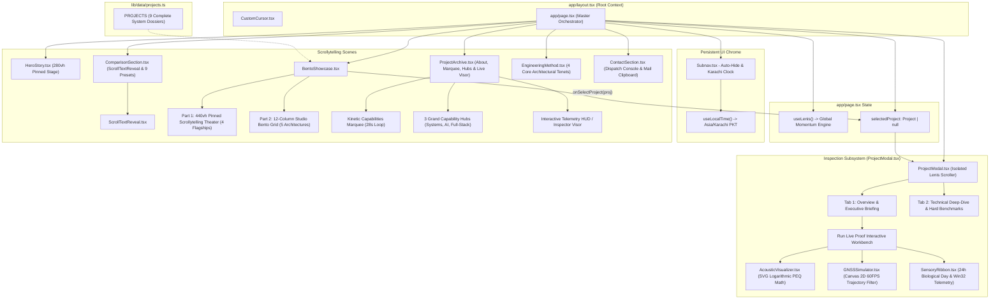

# Comprehensive UI & Frontend System Architecture
## Khuzaima Ahmed — Systems & AI Engineering Portfolio Omniverse

---

## 1. Executive Summary & Architectural Philosophy

The **Khuzaima Ahmed Portfolio Omniverse** is an editorial, cinematic scrollytelling engineering platform. Rather than functioning as a standard static portfolio, the application is engineered as a **deterministic, hardware-accelerated showroom** designed to convey low-level systems engineering, sensor fusion, real-time digital signal processing (DSP), and zero-overhead local-first AI architectures.

```
+--------------------------------------------------------------------------------------------------+
|                                    VISUAL & ENGINEERING PILLARS                                  |
+------------------------------------+------------------------------------+------------------------+
| 1. Cinematic Scrollytelling        | 2. Dual-Layer 120 FPS Momentum     | 3. In-Browser Proof    |
| - Pure #000000 carbon canvas       | - Decoupled Viewport Lenis Engine  | - Real-time biquad DSP |
| - Frosted glassmorphism (24px blur)| - Scoped Modal Momentum Scroller   | - 60 FPS Kalman Canvas |
| - -0.05em tight letter tracking    | - Hardware compositing layers      | - 24-hr sensory ribbon |
+------------------------------------+------------------------------------+------------------------+
```

### Core Design Values
- **Deterministic Aesthetics**: Minimalist dark UI palette adhering strictly to a high-contrast systems engineering design language (`#000000` pitch black, `#161617` elevated surfaces, `#1D1D1F` card bodies, and `#2997FF` electric blue accents).
- **Show, Don't Tell**: Replacing buzzwords with interactive mathematical models executed live on client silicon (logarithmic SVG PEQ frequency response calculator, HTML5 Canvas 2D GNSS Rauch-Tung-Striebel trajectory smoother, and Win32 ctypes sensory timeline simulation).
- **Dual-Layer Momentum Scroll Physics**: Global viewport momentum scrolling combined with non-blocking, isolated modal drawer scrolling, eliminating standard browser scrollbar friction.

---

## 2. Complete Component Hierarchy & Data Flow



---

## 3. Technology Stack & Runtime Dependencies

The project is built on a clean, modern React 18 / Next.js 14 stack:

| Technology | Version | Purpose in Architecture |
|---|---|---|
| **Next.js** | `14.2.24` | React Server Components & App Router orchestration |
| **React & React-DOM** | `^18.3.1` | Client-side reactive component tree |
| **TypeScript** | `^5.6.3` | Strict type validation and domain interfaces (`Project`, `EQBand`, `TechDetail`, etc.) |
| **Tailwind CSS** | `^3.4.14` | High-performance utility CSS with custom engineering design tokens |
| **Framer Motion** | `^11.11.17` | Hardware-accelerated transitions, `useScroll`, `useTransform`, spring physics |
| **Lenis** | `^1.1.18` | Decoupled smooth momentum physics for root viewport and deep-dive drawer |
| **Lucide React** | `^0.454.0` | Minimalist aerospace/hardware iconography |
| **Three.js** | `^0.169.0` | 3D mathematical primitives and geospatial coordinate calculations |
| **Google Fonts** | Inter, JetBrains Mono, Space Grotesk | Dual typography: Technical telemetry monospace + clean sans-serif |

---

## 4. Application Bootstrapping & Global Styling

### `app/layout.tsx`
- Sets the HTML document class to `dark` with a pure black background (`bg-black`) and standard foreground typography (`text-brand-text`).
- Enforces anti-aliasing: `-webkit-font-smoothing: antialiased` and `-moz-osx-font-smoothing: grayscale`.
- Mounts the global `<CustomCursor />` component at root level to ensure smooth pointer tracking across the viewport.

### `app/globals.css`
Defines CSS custom properties and acceleration rules:
```css
:root {
  --theme-black: #000000;
  --theme-space: #0A0A0C;
  --theme-surface: #161617;
  --theme-card: #1D1D1F;
  --theme-text: #F5F5F7;
  --theme-subtle: #86868B;
  --theme-blue: #2997FF;
}
```

Key Utility Classes:
- `.pro-card` / `.surface-card`: Provides `#161617` surface background, 1px `rgba(255, 255, 255, 0.08)` border, deep elevation shadow, and GPU composition layer via `transform: translateZ(0)` and `will-change: transform`.
- `.nav-glass-pill`: Applies `rgba(22, 22, 23, 0.82)` with 24px backdrop blur (`backdrop-filter: blur(24px)`).
- Ambient Specular Glows: `.specular-glow`, `.blue-glow`, and `.amber-glow` for background lighting effects.
- `.animate-marquee`: Hardware-accelerated infinite horizontal loop for capabilities marquee (28s duration, pauses on `:hover`).

---

## 5. Dual-Layer Momentum Physics: The Lenis Architecture

One of the most complex UI challenges in scrollytelling web apps is momentum scroll conflict when displaying deep-dive modal drawers over long pinned pages. The repository implements an isolated, two-tier scroll arbitration pattern:

```
+------------------------------------------------------------------------------------+
|                                 ROOT VIEWPORT                                      |
|  useLenis() -> Window Scroll Engine (duration: 0.85s, exponential easing)          |
|  Controlled via global (window as any).__lenis                                     |
+------------------------------------------------------------------------------------+
                                      |
                           [Project Click Trigger]
                                      |
                                      v
+------------------------------------------------------------------------------------+
|                         PROJECT DEEP-DIVE MODAL DRAWER                             |
|  1. document.body.style.overflow = "hidden"                                        |
|  2. (window).__lenis.stop()                                                        |
|  3. Instantiate Local Scoped Lenis(wrapper: scrollWrapperRef, duration: 0.80s)     |
|  4. Attribute: data-lenis-prevent="true" prevents event bubbling                   |
|  5. On Close: modalLenis.destroy() -> (window).__lenis.start()                      |
+------------------------------------------------------------------------------------+
```

---

## 6. Chrome & Telemetry Subsystems

### Custom Cursor (`components/chrome/CustomCursor.tsx`)
- **Hardware Mouse Tracking**: Driven by Framer Motion `useMotionValue` and `useSpring` with physics parameters:
  - `damping: 25`, `stiffness: 350`, `mass: 0.5`.
- **Dynamic States**:
  1. *Default State*: 6px electric blue center dot + 24px subtle ring.
  2. *Interactive Hover*: Ring expands to 44px (or 64px if a label is present).
  3. *Label Display*: If the hovered element defines `data-cursor-label="INSPECT"`, the ring renders monospace uppercase text inside the follower.

### Floating Master Navigation (`components/chrome/Subnav.tsx`)
- **Direction-Aware Auto-Hide**:
  - Scrolling down ($> 8\text{px}$) smoothly glides the subnav up $-85\text{px}$ (`opacity: 0`, `scale: 0.95`).
  - Scrolling back up ($< -8\text{px}$) or staying near top ($\le 80\text{px}$) smoothly returns it into view (`y: 0`, `opacity: 1`, `scale: 1`).
- Positioned as `sticky top-5 z-50` with high-elevation drop shadow and frosted glass backdrop (`bg-[#121215]/90 backdrop-blur-2xl border-white/15 rounded-full`).
- **Telemetry Clock**: Consumes the `useLocalTime` hook (`lib/hooks/useLocalTime.ts`), querying `Intl.DateTimeFormat` with `timeZone: "Asia/Karachi"` to render live Pakistan Standard Time (PKT) in a tabular monospace badge.

---

## 7. Cinematic Scrollytelling Storyboard (`HeroStory.tsx`)

The hero section uses a **280vh pinned viewport canvas** orchestrated through Framer Motion's `useScroll`:

1. **Stage 1 (`0.00` to `0.38`)**:
   - `stage1Opacity`: Linear fade from `1` down to `0` between 0.22 and 0.38.
   - Headline: *"Deterministic by construction."*
   - Embedded ambient GNSS simulator running at 30 FPS.
2. **Stage 2 (`0.22` to `0.80`)**:
   - Comparative Metrics Cards with rolling Odometers:
     - `88.4%`: Lower horizontal error (1.235m RTS smoothed RMS).
     - `0.0%`: CPU sensory overhead (Win32 foreground ctypes).
     - `≤ 0.5 dB`: Automated PEQ residual error (Harman 301-pt curve match).
3. **Stage 3 (`0.65` to `1.00`)**:
   - Fades in the transition prompt with a button linking directly to the `#bento` showcase.

---

## 8. Comparison Matrix & Kinetic Typography (`ComparisonSection.tsx`)

This section provides quantitative benchmarks contrasting Khuzaima's architectures against industry-standard implementations.

### Word-by-Word Scroll Reveal (`ScrollTextReveal.tsx`)
- Splits narrative sentences into individual words.
- Words matching `highlightWords` receive bold white weight, while standard words illuminate from subdued gray to readable silver.

### Preset Switcher System
Users can expand the comparison matrix and switch between 9 comparison presets:
- GNSS Positioning vs Raw Consumer GPS
- The Silent Auditor vs Screen-Recording Daemons
- AudioSage Auto-PEQ vs Manual PEQ Tuning
- CinemaVault CSV Encoding vs Verbose JSON Pipelines
- AI Learning Companion vs Traditional Scraping
- YT Tracker vs Cloud-Heavy Analytics
- Mobile Voice Notes Studio vs Sluggish Cloud Recorders
- My Location Diary vs Battery-Draining Geotrackers
- Smart Calorie Tracker vs Cloud-Locked Nutrition Apps

---

## 9. Flagship Bento Showcase & Extended Suite (`BentoShowcase.tsx`)

The showcase is divided into two distinct architectural tiers:

### Part 1: The Pinned Scrollytelling Theater (440vh Container)
- A **440vh pinned container** locks the viewport while the user scrolls through the **4 Core Flagships**:
  - Chapter 01: `GNSS Multi-Stream Precision Positioning Engine`
  - Chapter 02: `AudioSage: Audiophile Research Assistant & Acoustic Suite`
  - Chapter 03: `The Silent AI Daily Auditor & Life Chronicle`
  - Chapter 04: `CinemaVault: Taste-Profiling Recommendation Engine`
- **Interactive Chapter Pill Switcher**: Live chapter indicator pills (`01 GNSS`, `02 AudioSage`, etc.) with layoutId background indicator and intra-chapter progress rail.

### Part 2: The Extended Pro Suite (12-Column Balanced Grid)
Below the pinned theater, a balanced **12-column grid** displays the remaining 5 specialized architectures:
- `AI Learning Companion 2.0` (`lg:col-span-6`)
- `YT Tracker Growth Studio` (`lg:col-span-6`)
- `Mobile Voice Recorder & Notes Studio` (`lg:col-span-4`)
- `My Location Diary` (`lg:col-span-4`)
- `Smart Calorie Tracker App` (`lg:col-span-4`)

---

## 10. Deep-Dive Inspection Drawer & Live Proof Specimens (`ProjectModal.tsx`)

Clicking any project card opens a full-height sliding inspection drawer with dual tabs:

### Embedded Live Proof Workbenches:
* **Specimen A: AudioSage PEQ Synthesizer (`AcousticVisualizer.tsx`)**
  - Multi-band biquad bell equalization across logarithmic frequency ($20\text{ Hz} \to 20,000\text{ Hz}$) with Harman In-Ear 2019 target matching.
* **Specimen B: GNSS RTS Trajectory Filter (`GNSSSimulator.tsx`)**
  - 60 FPS HTML5 Canvas 2D simulation rendering NovAtel 2cm RTK truth, raw GPS SPP L1 (10.89m RMS), and RTS backward-smoothed path (1.235m RMS) with tunnel blackout mode.
* **Specimen C: 24-Hour Biological Day Ribbon (`SensoryRibbon.tsx`)**
  - 24-hour discrete timeline blocks visualizing Win32 foreground ctypes polling at 5000ms intervals.

---

## 11. Developer & Maintenance Playbook

### Running Locally
```bash
# Install dependencies
npm install

# Run development server
npm run dev

# Build production bundle
npm run build

# Start production server
npm run start
```

---

&copy; 2026 Khuzaima Ahmed. Built with deterministic architecture.
